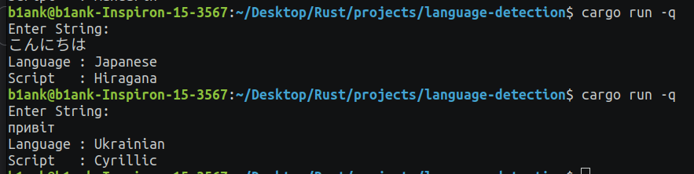

# natural-language-detection-rust

Whatlang is a simple Rust library that focuses on the detection of natural language in a text. This library is used to identify scripts represented by a list of enumerations, also known as enums. It only detects language and script.

  

